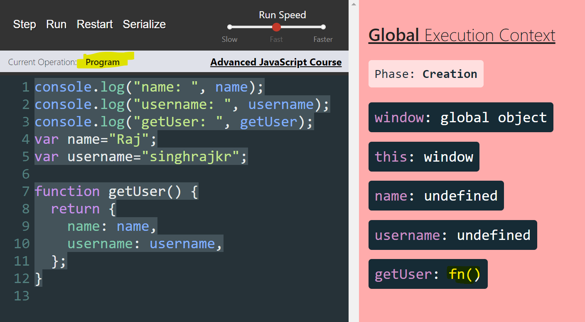
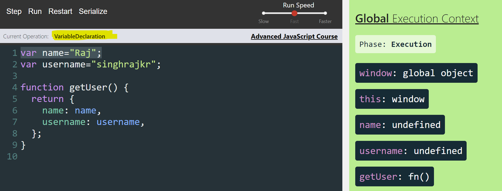
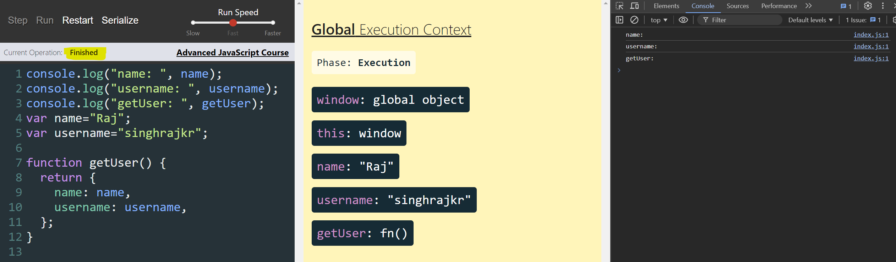
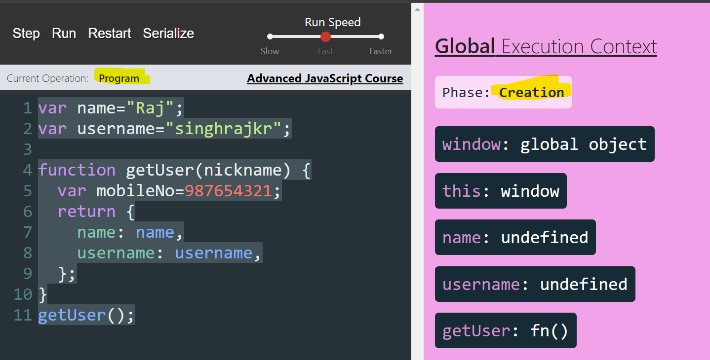
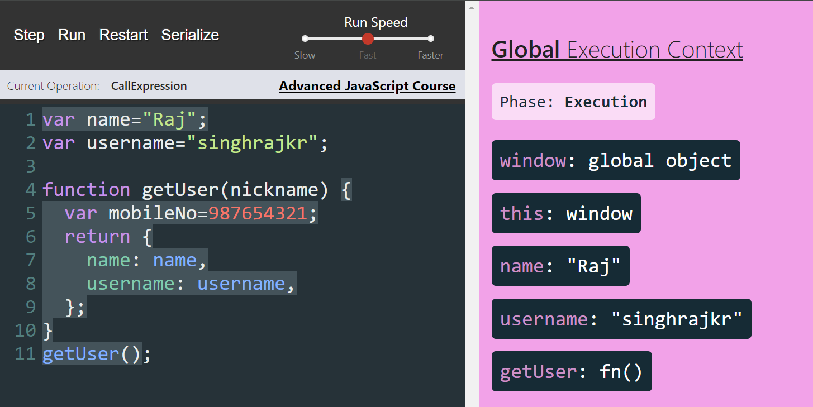
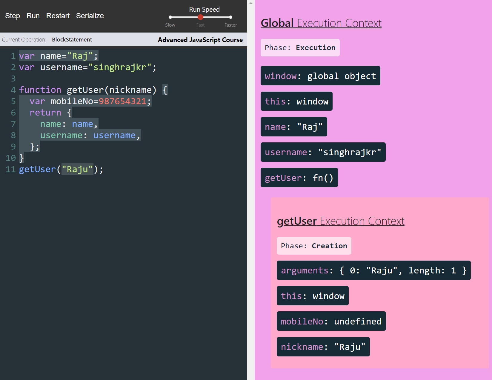
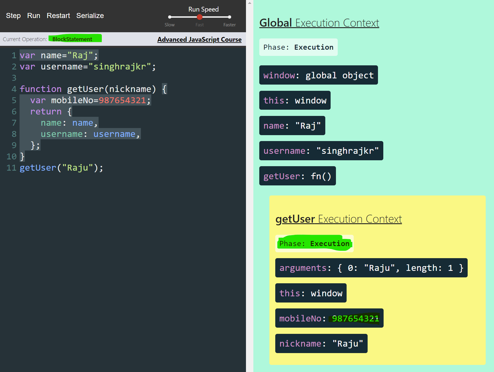
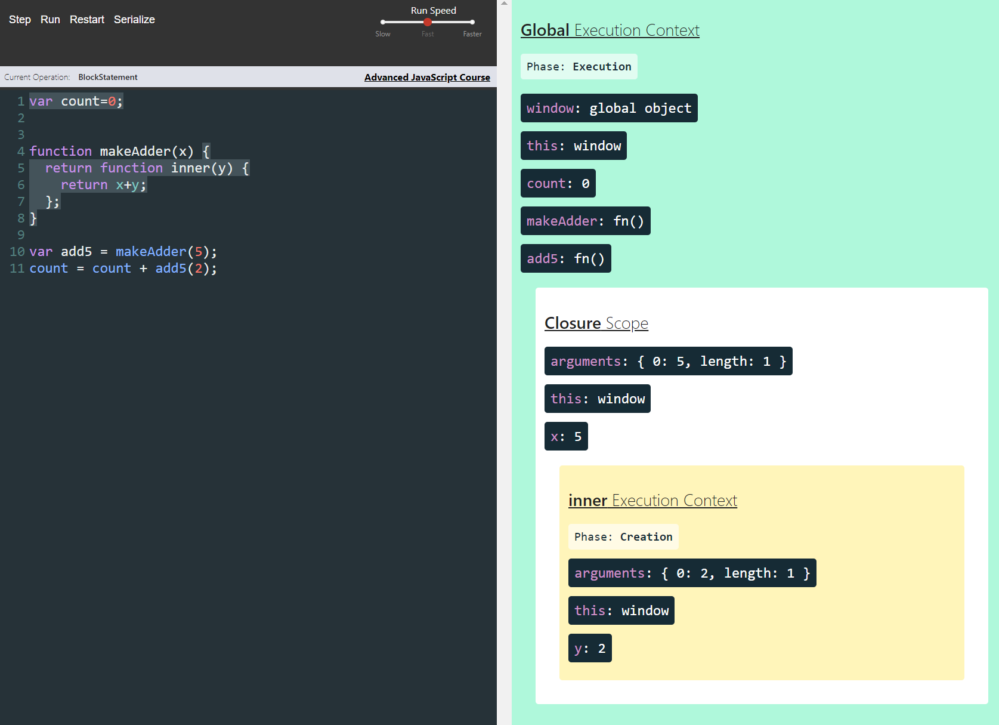

# JavaScript Fundamentals

## **Global** Execution Context(Without Program)

Phase: **Creation**

* **window**: **global object**
* **this**: **window**

## **Global** Execution Context(with Program)

#### Phase: **Creation:** 4 things happen in creation phase:

1. Create a **global object** ======>>>> **window**: **global object**
2. Create an object called "**this**" ======>>>> **this**: **window**
3. Set up **memory space** for **variables** and **functions.**
4. Assign variables declarations a **default** value of "**undefined"** while placing any **function** declaration  in memory**->
   **name: undefined,
   username: undefined,
   getUser: fn() ===> placing function in memory**

   And then creation phase is now over.



```javascript
var name="Raj";
var username="singhrajkr";
function getUser() {
  return {
    name,
    username
  }
}
```

Put this in console during creation phase:

```javascript
console.log("name: ", name);
console.log("username: ", username);
console.log("getUser: ", getUser);
var name="Raj";
var username="singhrajkr";function getUser() {
  return {
    name: name,
    username: username,
  };
}
```

##### Hoisting in JavaScript:

The process of assigning a variable declaration a default value of "undefined" during creation phase of Execution context.

* **name**: **undefined**
* **username**: **undefined**

#### Phase: **Execution**

**This is the is phase in which JavaScript starts executing your code line by line.**



After Execution is Finished



```javascript
console.log("name: ", name);  // Expression Statement
console.log("username: ", username); // Expression Statement
console.log("getUser: ", getUser); // Expression Statement
var name="Raj";
var username="singhrajkr";function getUser() {
  return {
    name: name,
    username: username,
  };
}
```

*`console.log("name: ", name); ` // Expression Statement*

*`console.log("name: ", name)` // Call Expression*

*`var name="Raj";` // Variable Declaration*

*`function getUser() { return { name: name, username: username };}`  // Function Declaration*

## Function Execution Context:

* Creates an arguments object ======>>>> **window**: **global object**
* Create an object called "**this**" ======>>>> **this**: **window**
* Set up **memory space** for **variables** and **functions.**
* Assign variables declarations a **default** value of "**undefined"** while placing any **function** declaration  in memory**->
  **name: undefined,
  username: undefined,
  getUser: fn() ===> placing function in memory**

```javascript
var name="Raj";
var username="singhrajkr";function getUser(nickname) {
  var mobileNo=987654321;
  return {
    name: name,
    username: username,
  };
}
getUser();

```



### Global Execution Context:



### Function Execution Context when Function is Invoked:

##### Phase: Creation



##### Phase: Execution

Once the function context execution will be finished. Function context will be popup/removed from Execution Stack.



## Scope

First Function Execution Context will look for variable inside it's own scope.

If it can't find in it's own scope then it will look for the variable in it's **immediate parent Scope(Parent Execution Context)**.

This process will continue until it finds the variable in it's parent scope at any level upto **Global Scope( Global Execution Context)**.

If it find it will utilize else Reference Error will be thrown.

## Closures ( Scope Chain)



## "this" keyword

###### Implicit Binding - Left of the dot at Call Time

Example-1

```javascript
var me = {  
name:"Raj",  
age:25,  
sayName:function () {  
console.log(this.name);  
}}
// Left of the dot at Call Time
thisRefToMe.sayName();

```

Example-2

```javascript
var sayNameMixin=function (obj) {  
obj.sayName=function () {  
console.log(this.name);  
}};

var me= {  
name:"Raj",  
age:25,
};
var you= {  
name:"Ranjay",  
age:22,
};
sayNameMixin(me);
sayNameMixin(you);
me.sayName();
you.sayName();
```

Example - 3

```javascript
var Person = function (name, age) {
    return {
        name: name,
        age: age,
        sayName: function() {
            console.log(this.name);
        },
        college: {
            name: 'PIMS, Gwalior',
            sayName: function() {
                console.log(this.name);
            }
        }
    }
}var raj = Person('Raj', 30);
//this inside sayName() refers to raj i.e Left of the dot at Call Time.so root/parent object name will be invoked
raj.sayName();//this inside sayName() refers to college i.e Left of the dot at Call Time. so the college name will be invoked
raj.college.sayName();
```

###### Explicit Binding ( with .call, .apply and .bind )

**.call** - A function will be invoked based on passed reference to call. and "this" is going to reference to the passed reference value. Pass argument to function one by all

**.apply** - Is exactly same is **.call** with a little difference. It accepts function arguments as an Array( it parse array argument to individual arguments)

**.bind -** Is exactly same as **.call** except there is only one difference. **.bind** returns a brand new function which can be invoked immediately or later ( passed arguments will remain static to brand new retruned function).

Example -1 for "**.call**"

```javascript
// Explicit Binding
// call, apply, bind
var sayName = function () {
    console.log('My Name is: ',this.name);
}
var raj = {
    name: 'Raj',
    age: 30,
}
// Call - sayName is going to be invoked and "this" keyword inside sayName is going to reference "raj" object
// first argument is reference, and last 3 are function arguments
sayName.call(raj);

```

Example -2 for ".call"

```javascript
// Explicit Binding
// call, apply, bind
var sayName = function (lang1, lang2, lang3) {
    console.log('My Name is: '+this.name+' and I know '+ lang1 + ',' + lang2 +','+lang3);
}
var raj = {
    name: 'Raj',
    age: 30,
}var languages = ["JavaScript", "Python", "Java"]// Call - sayName is going to be invoked and "this" keyword inside sayName is going to reference "raj" object
// first argument is reference, and last 3 are function arguments
sayName.call(raj, languages[0], languages[1], languages[2]);
```

Example -1 for "**.apply**"

```javascript
// Explicit Binding
// call, apply, bind
var sayName = function (lang1, lang2, lang3) {
    console.log('My Name is: '+this.name+' and I know '+ lang1 + ',' + lang2 +','+lang3);
}
var raj = {
    name: 'Raj',
    age: 30,
}

var languages = ["JavaScript", "Python", "Java"]

// first argument is reference, and last is function arguments
sayName.apply(raj, languages);

```

Example-1 for ".bind"

```javascript
// Explicit Binding
// call, apply, bind
var sayName = function (lang1, lang2, lang3) {
    console.log('My Name is: '+this.name+' and I know '+ lang1 + ',' + lang2 +','+lang3);
};
var raj = {
    name: 'Raj',
    age: 30,
};var languages = ["JavaScript", "Python", "Java"];// Call - sayName is going to be invoked and "this" keyword inside sayName is going to reference "raj" object
// first argument is reference, and last 3 are function arguments
var newSayNameFn = sayName.bind(raj, languages[0], languages[1], languages[2]);
console.log("HERE");
newSayNameFn();
```

###### new Binding

```javascript
// new Binding
var Person = function(name, age) {
    this.name = name;
    this.age = age;
};
// "this" keyword will be bound to the new object which is constructed
var raj = new Person('Raj', 25);
```

###### window Binding

```javascript
//window Binding - applicable for browser
var sayName = function() {
    console.log(this.name);
}var me = {
    name: "Raj"
}
//If there is no reference before dot(along with dot for example someThis.FuncName()).Then by default sayName()-> "this" will point to window object.
//Right now there is no "name" defined in window/Global scope so it will throw undefine error. Let's declare a name variable inside window scope
this.name = "Ranjay";
sayName();
```


### The Evolution of Async JavaScript - From Callbacks, to Promises, to Async/Await
